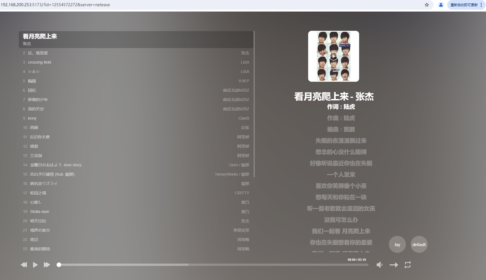

# web-music-play
一款沉浸式网页音乐播放器

由 [HeoMusic](https://github.com/zhheo/HeoMusic) 修改而来，感谢原作者的辛勤付出！！！

原项目是html5+js实现，本项目采用vite+vue3+ts实现。

运行效果:


# roadmap
- [x] 整体修改为vite+vue3+ts, 可以正常运行
- [x] 可以按照指定数据格式自定义歌单，参考 /public/json/jay.json
- [x] url上可指定网络平台歌单参数，例如: https://music.zdog.top?id=12554572272&type=netease

# 如何部署
```shell
pnpm i && \
pnpm build
```
然后将构建后的dist目录下的所有文件，上传到服务器即可。

# 歌单
- netease, playlist, 12554572272, 网易云歌单
- local, playlist, /public/json/jay.json, 本地歌单