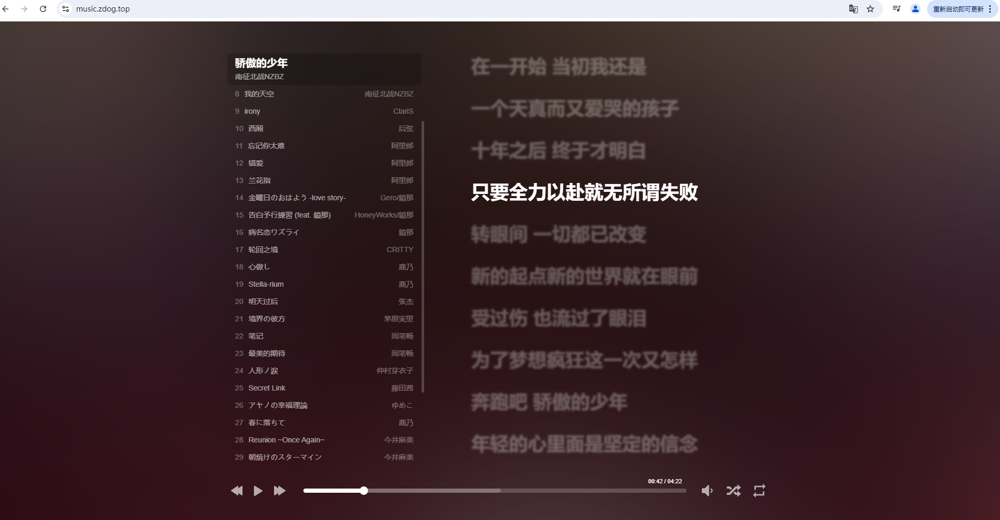

# web-music-play
一款沉浸式网页音乐播放器

由 [HeoMusic](https://github.com/zhheo/HeoMusic) 修改而来，感谢原作者的辛勤付出！！！

原项目是html5+js实现，本人改进为vite+vue3+ts实现。

运行效果:

# roadmap
- [x] 整体修改为vite+vue3+ts, 可以正常运行
- [ ] 自定义常用歌单，并且可切换
- [ ] 本地自定义歌单实现
- [ ] metingjs api接口可切换
- [ ] 发现了一些样式上的bug，不太擅长改样式，看情况改吧

# fork
可直接fork进行修改

# 如何部署
本项目采用github pages部署(白嫖，嘻嘻！)，其他平台均可。

将构建后的dist文件内容上传到服务器即可。

自定义域名[可选]