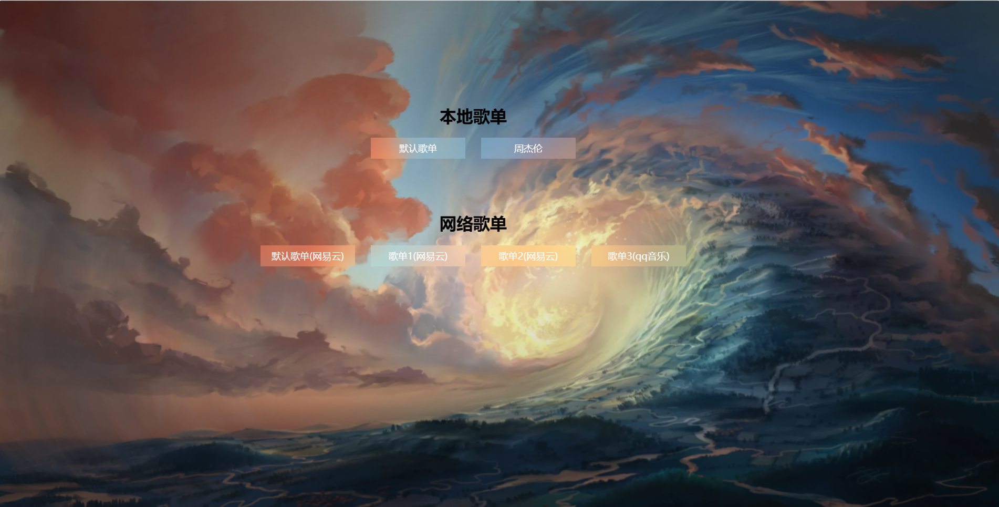
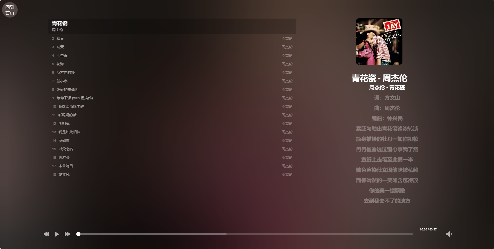

# web-music-play
一款沉浸式网页音乐播放器

本项目采用vite+vue3+ts等技术实现。

运行效果:




## 参考
- [HeoMusic](https://github.com/zhheo/HeoMusic)
- [MetingJS](https://github.com/metowolf/MetingJS)
- [APlayer](https://github.com/DIYgod/APlayer)

本项目参考或复用了以上项目代码，感谢原作者的辛勤付出！！！

# roadmap
- [x] 整体修改为vite+vue3+ts, 可以正常运行
- [x] 支持自定义歌单参数，不管是本地歌单还是网络歌单

# 如何部署
```shell
pnpm i && \
pnpm build
```
然后将构建后的dist目录下的所有文件，上传到服务器即可。

# 支持自定义本地歌单
- /public/playlist/default.json
- /public/playlist/jay.json

# 支持网络歌单
要求歌单必须是公开的，支持 'netease' | 'tencent' | 'kugou' | 'xiami' | 'baidu'
- netease, playlist, 12554572272, 网易云歌单